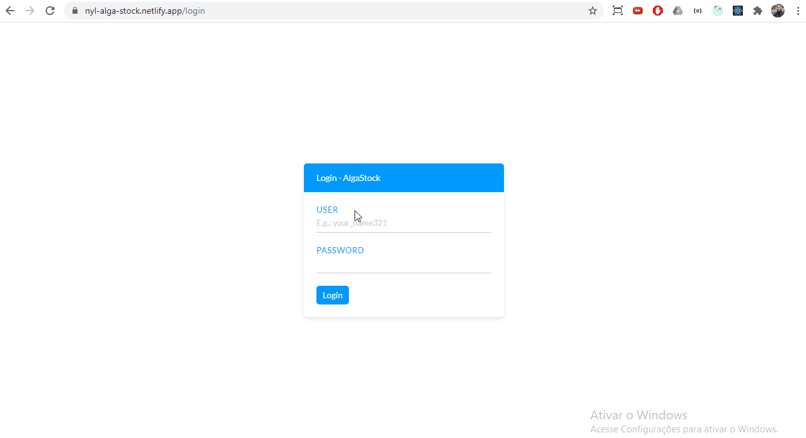

# Ignição React da Algaworks

Descrição: Aprenda a desenvolver aplicações front-end com React do zero ao intermediário do jeito certo.

Link: 🔗[Curso Ignição React by Algaworks](https://cafe.algaworks.com/fpigr-pv1/)

## 💻 Projeto do curso

Projeto - AlgaStock - Projeto para cadastro e gerenciamento de produtos em um estoque. Envolve autenticação de usuários com restrição de visualização.

## :camera: Demonstração



## 🌏 Projeto online

- [Frontend AlgaStock - Netlify](https://nyl-alga-stock.netlify.app/)
- [Backend AlgaStock - Heroku](https://nyl-api-alga-stock.herokuapp.com/)

## 🔒 Credenciais

- Admininstrador: usuário `daniel` e senha `123`
- Comum: usuário `joselito` e senha `321`

## :rocket: Conceitos e tecnologias

✔️ React

✔️ Sass

✔️ Swal

✔️ Fetch API

✔️ Axios

✔️ Prism

✔️ Redux (thunk e persist)

✔️ React Router DOM

✔️ HOC (High Order Component)

✔️ Autenticação com token JWT

✔️ Deploy Netlify e Heroku

✔️ Pagination

✔️ Git e GitHub

## ⚙️ Comandos

- Criar projeto do curso: `npx create-react-app alga-stock --template typescript`

- Iniciar projeto: `cd alga-stock` e `npm start ou yarn start`

- Comandos para deploy no Heroku

```bash
$ heroku login
$ git init
$ heroku git:remote -a nyl-api-alga-stock
$ git add .
$ git commit -am "commit message"
$ git push heroku master
$ heroku logs --tail
```

## :phone: Contato

 Linkedin [https://www.linkedin.com/in/danyllo-valente-da-silva-3569b460](https://www.linkedin.com/in/danyllo-valente-da-silva-3569b460)

:postbox: E-mail [danyllo.dvs@gmail.com](danyllo.dvs@gmail.com)
